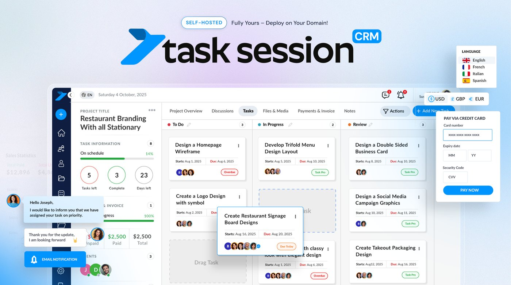
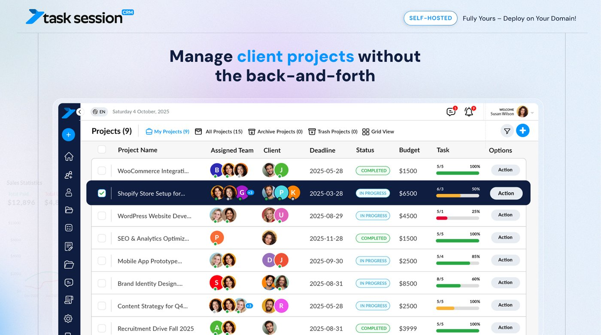
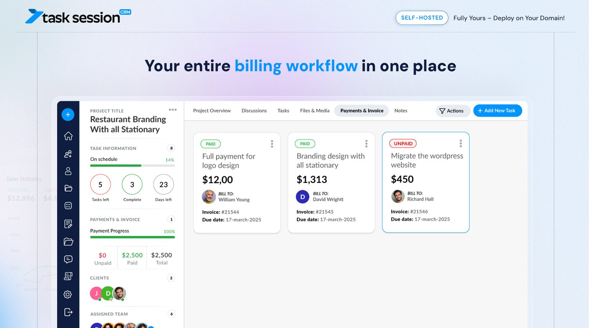
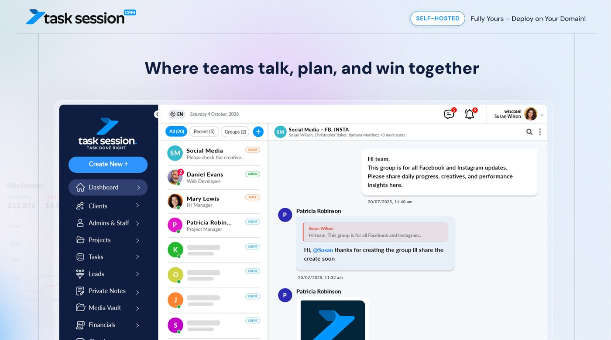
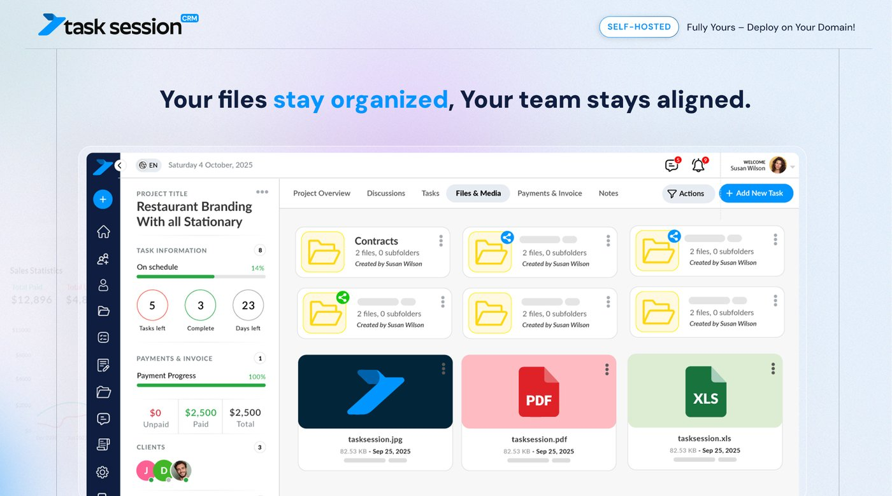

<div align="center">

# TaskSession CRM — Free Edition

**Self-hosted CRM & project management for agencies, freelancers and teams.**
Manage clients, projects and tasks on your own domain, with your own data.

[**Live Demo**](https://demo.tasksession.com/) · [Website](https://tasksession.com) · [Changelog](https://www.tasksession.com/changelog/) · [Get Pro](https://www.tasksession.com/pricing/)




</div>

## Live Demo

Try TaskSession CRM before you install it: **[demo.tasksession.com](https://demo.tasksession.com/)**

## Features (Free Edition)

- **Projects** — create, edit, archive and track projects with deadlines, budgets and progress
- **Tasks** — list view, Kanban board, bulk task creation, task permissions and archive
- **Client portal** — clients log in to see their projects and tasks
- **Team & roles** — admins, staff and clients with role-based permissions
- **Calendar** — deadlines and events in one view
- **Notes** — project notes and private notes
- **Activity log & notifications** — see who did what and when
- **Branding** — your own logo, theme colors and menu labels
- **Email notifications** — via your own SMTP server
- **Web installer** — install in a few minutes, no command line needed

## Free vs Pro

| Feature | Free | Pro |
|---|:---:|:---:|
| Projects, tasks & Kanban board | ✅ | ✅ |
| Client portal & staff accounts | ✅ | ✅ |
| Roles & permissions | ✅ | ✅ |
| Calendar & notes | ✅ | ✅ |
| Invoices, payments & subscriptions (Stripe) | — | ✅ |
| Team chat, task chat & project discussions | — | ✅ |
| Files & Media, Media Vault, Google Drive | — | ✅ |
| Leads CRM & client companies | — | ✅ |
| Built-in email (Gmail, Outlook, IMAP/SMTP) | — | ✅ |
| Attendance, shifts & payroll export | — | ✅ |
| Task, project & financial reports | — | ✅ |
| Custom fields | — | ✅ |
| Google Login, Google Calendar & 2FA | — | ✅ |
| Add-ons (AI Assistant, Email Marketing, WooCommerce) | — | ✅ |

👉 Compare plans at **[tasksession.com/pricing](https://www.tasksession.com/pricing/)**

## Screenshots

> Screenshots show TaskSession CRM. Some modules shown (chat, invoices, files & media) are part of the Pro edition.

| Projects | Invoices & billing |
|---|---|
|  |  |
| **Team chat** | **Files & media** |
|  |  |

## Requirements

- PHP 8.0 or higher
- MySQL or MariaDB
- PHP extensions: `mysqli`, `curl`, `gd`, `mbstring`, `openssl`, `zip`
- Apache with `mod_rewrite` (an `.htaccess` file is included)

## Installation

1. Download the [latest release](https://github.com/tasksession/tasksession-crm/releases/latest), or clone the repository:
   ```bash
   git clone https://github.com/tasksession/tasksession-crm.git
   ```
2. Upload the files to your web server (e.g. `public_html` or a subfolder).
3. Create an empty MySQL database and user.
4. Open `https://your-domain.com/install/` in your browser and follow the installer.
5. After installation, delete or protect the `install/` folder.
6. (Optional) Set up the scripts in `cron/` as cron jobs for reminders and recurring tasks.

## Changelog

See [CHANGELOG.md](CHANGELOG.md) or the full history at [tasksession.com/changelog](https://www.tasksession.com/changelog/).

## Support

- Bugs and feature requests: open an [Issue](https://github.com/tasksession/tasksession-crm/issues)
- Security issues: see [SECURITY.md](SECURITY.md) (please don't open a public issue)
- Website: [tasksession.com](https://tasksession.com)

## License

TaskSession CRM Free Edition is licensed under the [GNU Affero General Public License v3.0 (AGPL-3.0)](LICENSE).
If you modify it and distribute it or run it as a network service, you must make your modified source code available under the same license.

"TaskSession" name and logo are not covered by this license.
